# TimeCuber — Timer de Rubik para iOS

Aplicación iOS nativa desarrollada en Swift y SwiftUI para speedcubing. Cronometra tus solves, genera scrambles automáticos para 12 tipos de puzzles WCA y sigue tus estadísticas, todo en una interfaz limpia y nativa.

---

## Capturas de Pantalla

### Cronómetro
| Dark Mode | Light Mode |
|-----------|------------|
| 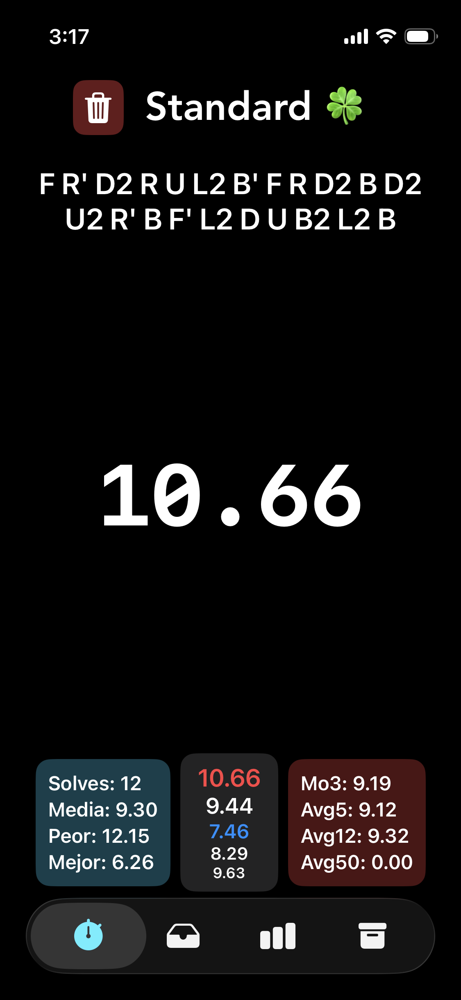 | 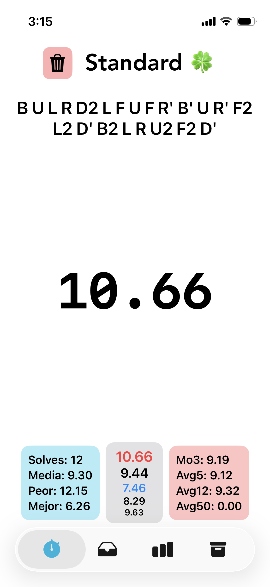 |

### Categorías y Sesiones
| Dark | Light | Nueva Sesión (Dark) | Nueva Sesión (Light) |
|------|-------|---------------------|----------------------|
| 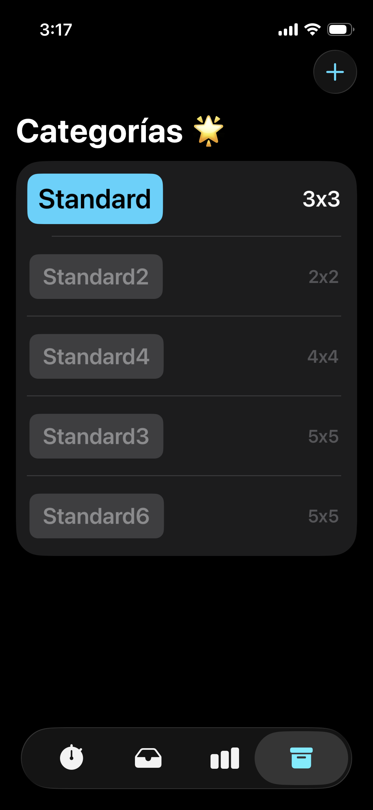 | 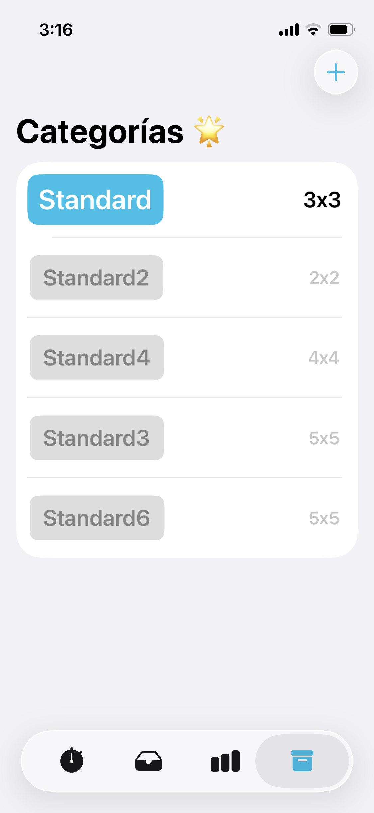 | 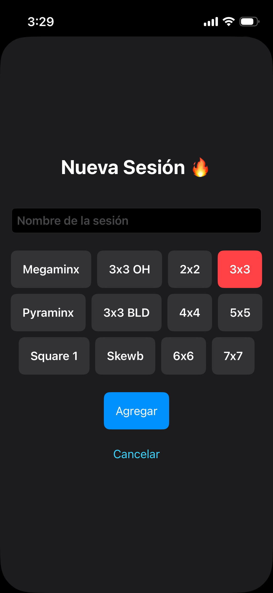 | 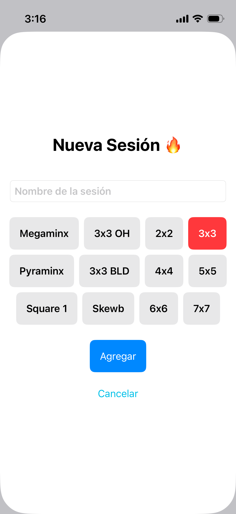 |

### Historial de Tiempos
| Lista (Dark) | Lista (Light) | Eliminar (Dark) | Eliminar (Light) |
|--------------|---------------|-----------------|------------------|
| 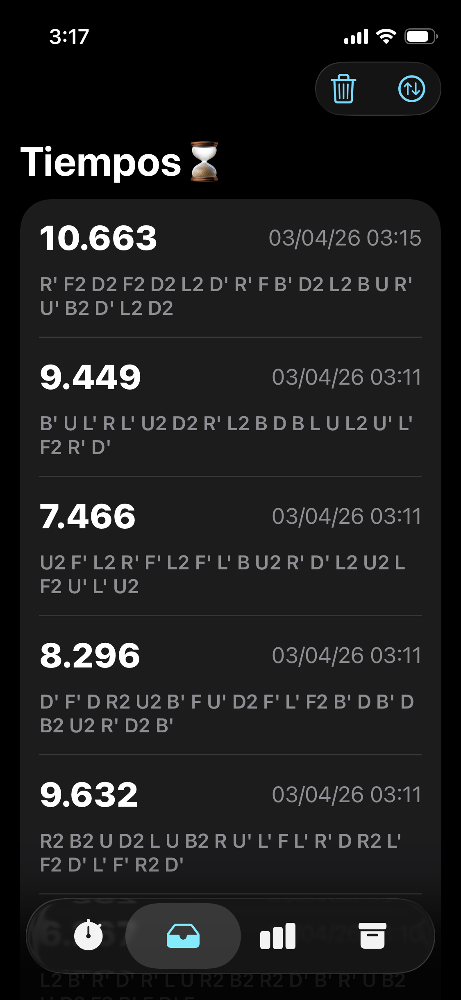 | 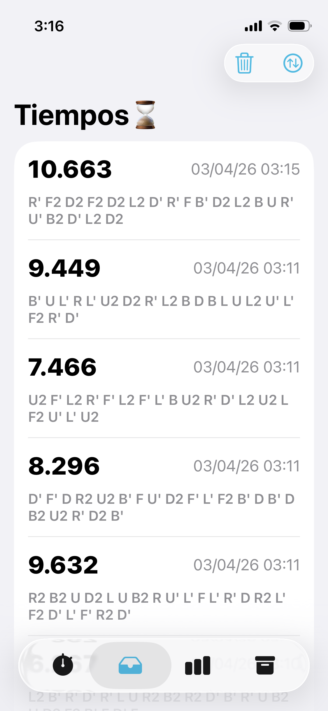 | 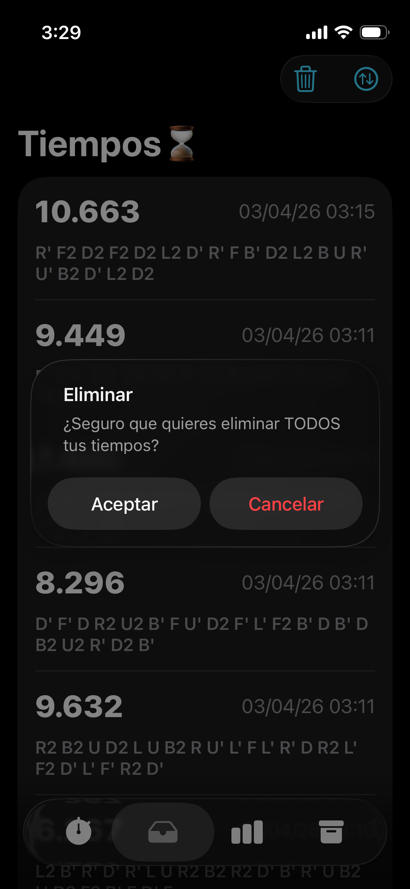 | 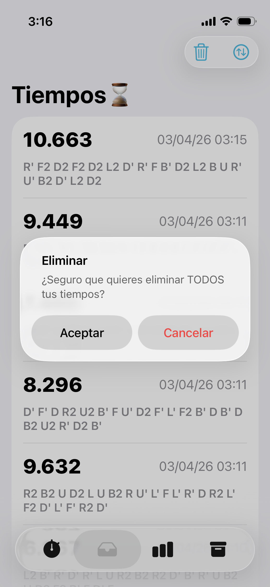 |

### Estadísticas Avanzadas
| Estadísticas (Dark) | Estadísticas (Light) | Gráfica (Dark) | Gráfica (Light) |
|---------------------|----------------------|----------------|-----------------|
| 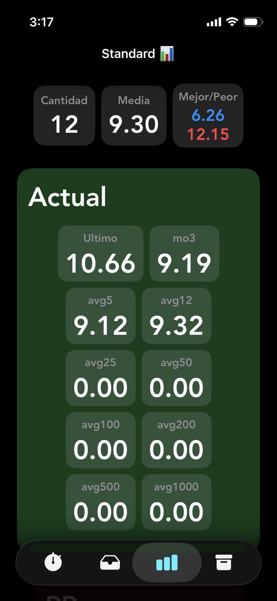 | 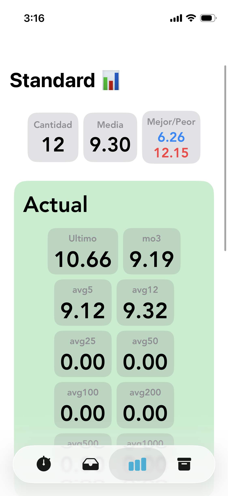 | 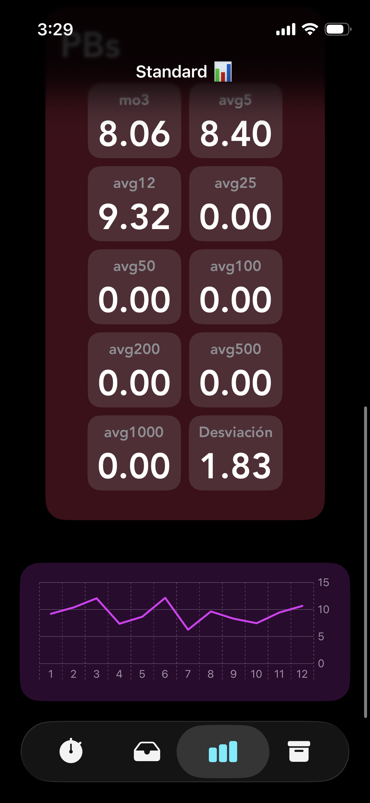 | 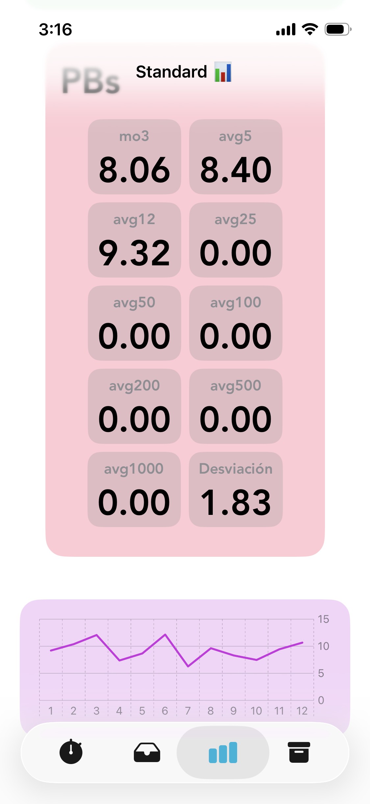 |

---

## Funcionalidades

- **Cronómetro táctil** — inicia y deten el timer con solo tocar la pantalla
- **Scrambles automáticos** — mezclas aleatorias específicas para cada puzzle al iniciar y después de cada solve
- **12 puzzles WCA** — 3x3, 2x2, 4x4, 5x5, 6x6, 7x7, 3x3 OH, 3x3 BLD, Pyraminx, Megaminx, Skewb, Square-1
- **Múltiples sesiones** — crea y gestiona varias sesiones por categoría
- **Stats en tiempo real** — Mo3, Ao5, Ao12, Ao50 siempre visibles debajo del cronómetro
- **Estadísticas avanzadas** — PBs históricos, desviación estándar y gráficas de progreso
- **Historial completo** — cada solve con fecha, scramble y opción de eliminar individualmente
- **Persistencia automática** — todos los datos se guardan localmente entre sesiones
- **Dark & Light Mode** — soporte nativo completo

---

## Tecnologías


---

## Instalación

**Requisitos:** macOS con Xcode · iOS 18+ · Cuenta de desarrollador Apple (para dispositivo físico)

```bash
git clone https://github.com/rlaur205/rubik-timer-swift.git
cd rubik-timer-swift
open TimerV3.xcodeproj
```

Selecciona un simulador o dispositivo en Xcode y presiona `Cmd + R`.


---

## Documentación

Ver [DOCUMENTACION.md](DOCUMENTACION.md) para la documentación completa.

---

## Mejoras Futuras

- Penalizaciones WCA (+2 y DNF)
- Sincronización iCloud
- Exportar tiempos en formato CSV
